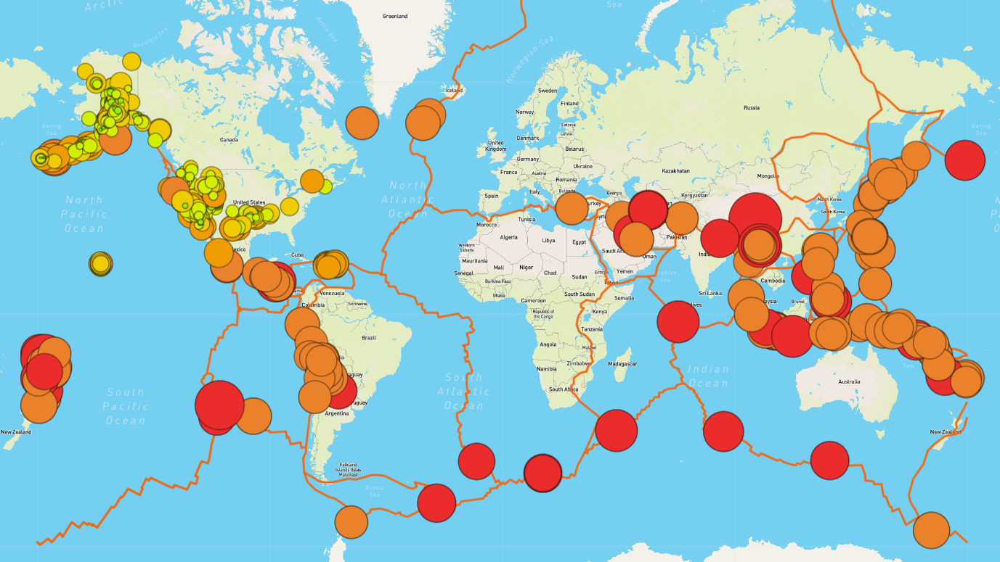

# Mapping_Earthquakes

In this project, I created a map of global earthquakes from the past seven days using data drawn from the US Geologic Survey. The map controls allow the user to toggle on or off the overlays for all earthquakes, major earthquakes, and tectonic plates, as well as to switch between several different base maps.

Loading the [Earthquake_Challenge/index.html](Earthquake_Challenge/index.html) will display a map that appears as follows:

 

